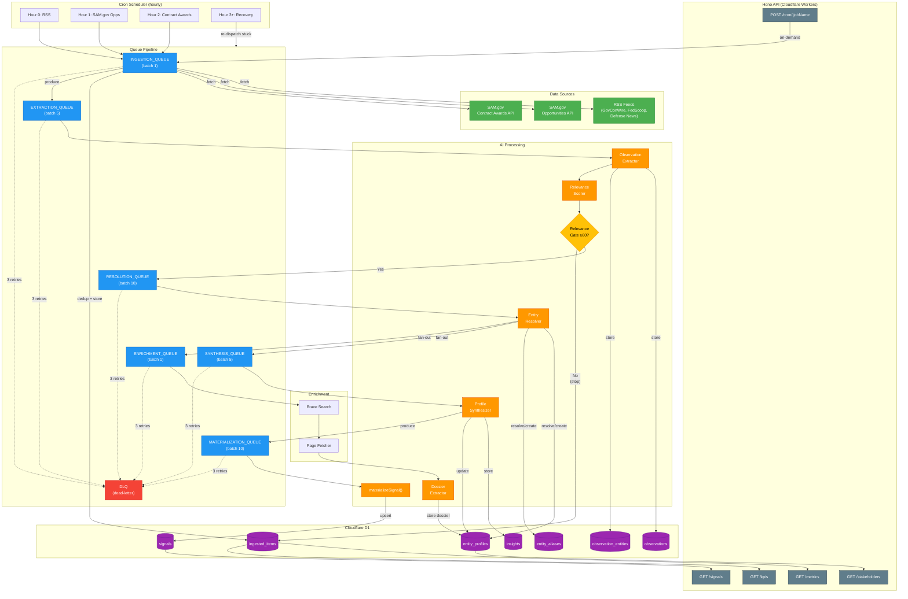

# Overwatch API — Architecture Diagram

```mermaid
graph TD
    subgraph Sources["Data Sources"]
        RSS["RSS Feeds<br/>(GovConWire, FedScoop,<br/>Defense News)"]
        SAM["SAM.gov<br/>Opportunities API"]
        CA["SAM.gov<br/>Contract Awards API"]
    end

    subgraph Cron["Cron Scheduler (hourly)"]
        H0["Hour 0: RSS"]
        H1["Hour 1: SAM.gov Opps"]
        H2["Hour 2: Contract Awards"]
        H3["Hour 3+: Recovery"]
    end

    subgraph Pipeline["Queue Pipeline"]
        IQ["INGESTION_QUEUE<br/>(batch 1)"]
        EQ["EXTRACTION_QUEUE<br/>(batch 5)"]
        RQ["RESOLUTION_QUEUE<br/>(batch 10)"]
        SQ["SYNTHESIS_QUEUE<br/>(batch 5)"]
        ENQ["ENRICHMENT_QUEUE<br/>(batch 1)"]
        MQ["MATERIALIZATION_QUEUE<br/>(batch 10)"]
        DLQ["DLQ<br/>(dead-letter)"]
    end

    subgraph AI["AI Processing"]
        OBS["Observation<br/>Extractor"]
        REL["Relevance<br/>Scorer"]
        GATE{"Relevance<br/>Gate ≥60?"}
        ER["Entity<br/>Resolver"]
        PS["Profile<br/>Synthesizer"]
        DE["Dossier<br/>Extractor"]
        MS["materializeSignal()"]
    end

    subgraph Enrichment["Enrichment"]
        BS["Brave Search"]
        PF["Page Fetcher"]
    end

    subgraph DB["Cloudflare D1"]
        II[("ingested_items")]
        OB[("observations")]
        OE[("observation_entities")]
        EP[("entity_profiles")]
        EA[("entity_aliases")]
        INS[("insights")]
        SIG[("signals")]
    end

    subgraph API["Hono API (Cloudflare Workers)"]
        GET_SIG["GET /signals"]
        GET_KPI["GET /kpis"]
        GET_STK["GET /stakeholders"]
        GET_MET["GET /metrics"]
        POST_CRON["POST /cron/:jobName"]
    end

    %% Cron triggers
    H0 --> IQ
    H1 --> IQ
    H2 --> IQ

    %% Source fetching
    IQ -->|"fetch"| RSS
    IQ -->|"fetch"| SAM
    IQ -->|"fetch"| CA
    IQ -->|"dedup + store"| II
    IQ -->|"produce"| EQ

    %% Extraction
    EQ --> OBS
    OBS -->|"store"| OB
    OBS -->|"store"| OE
    OBS --> REL
    REL --> GATE
    GATE -->|"Yes"| RQ
    GATE -->|"No<br/>(stop)"| II

    %% Resolution
    RQ --> ER
    ER -->|"resolve/create"| EP
    ER -->|"resolve/create"| EA
    ER -->|"fan-out"| SQ
    ER -->|"fan-out"| ENQ

    %% Synthesis
    SQ --> PS
    PS -->|"store"| INS
    PS -->|"update"| EP
    PS -->|"produce"| MQ

    %% Enrichment (terminal)
    ENQ --> BS
    BS --> PF
    PF --> DE
    DE -->|"store dossier"| EP

    %% Materialization
    MQ --> MS
    MS -->|"upsert"| SIG

    %% DLQ (all queues)
    IQ -.->|"3 retries"| DLQ
    EQ -.->|"3 retries"| DLQ
    RQ -.->|"3 retries"| DLQ
    SQ -.->|"3 retries"| DLQ
    ENQ -.->|"3 retries"| DLQ
    MQ -.->|"3 retries"| DLQ

    %% Recovery
    H3 -->|"re-dispatch stuck"| Pipeline

    %% API reads
    SIG --> GET_SIG
    EP --> GET_STK
    II --> GET_MET
    II --> GET_KPI

    %% On-demand
    POST_CRON -->|"on-demand"| IQ

    %% Styling
    classDef source fill:#4CAF50,color:#fff,stroke:#388E3C
    classDef queue fill:#2196F3,color:#fff,stroke:#1565C0
    classDef ai fill:#FF9800,color:#fff,stroke:#E65100
    classDef db fill:#9C27B0,color:#fff,stroke:#6A1B9A
    classDef api fill:#607D8B,color:#fff,stroke:#37474F
    classDef dlq fill:#F44336,color:#fff,stroke:#C62828
    classDef gate fill:#FFC107,color:#000,stroke:#F57F17

    class RSS,SAM,CA source
    class IQ,EQ,RQ,SQ,ENQ,MQ queue
    class OBS,REL,ER,PS,DE,MS ai
    class II,OB,OE,EP,EA,INS,SIG db
    class GET_SIG,GET_KPI,GET_STK,GET_MET,POST_CRON api
    class DLQ dlq
    class GATE gate
```
